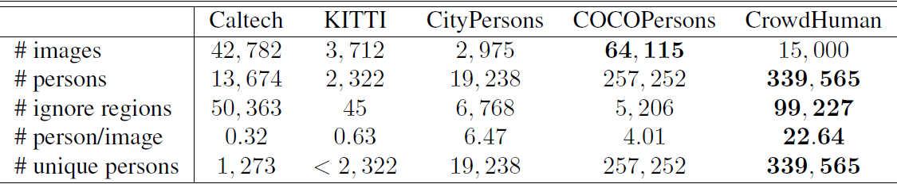
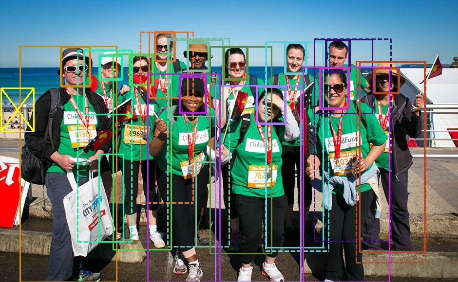
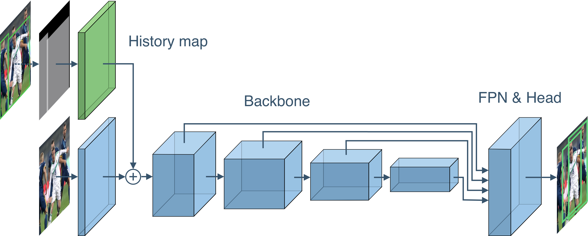

本baseline基于Iterdet，略微修改了配置文件。该算法2020.5月才放出，是目前crowdhuman数据集的SOTA。Baseline得分`0.7809`。

原工程地址 https://github.com/saic-vul/iterdet


### 赛题分析
本题是一个典型的目标检测问题，针对目标检测已有大量的研究论文和开源项目，例如faster-RCNN、YOLO等等。

与绝大多数的目标检测任务不同，比赛数据集CrowdHuman待检目标更加的密集、拥挤甚至有严重的重叠现象。从下表可以看出，该数据集平均每张图的人物数达到了22.64个，远大于其他主流的人体检测数据集。这是本赛题的难点所在。


下面放一个样例图片大家感受一下


### Baseline算法特点
Iterdet算法的主要贡献就是提供了一种解决大量密集目标检测的新方法。它的主要方式是通过迭代的方式循序渐进地进行多次检测，每次检测都会引入上次检测的结果作为特征(即下图的History map)。


论文在检测网络部分并没有做太多的创新，因此可以替换Backbone和FPN&Head来进一步提升算法性能。

### 目录结构
本算法使用`mmdetection`框架进行开发，目录结构也比较典型。
- `mmdet`是主要的代码文件夹，在`mmdetection`的基础上论文作者修改了以下文件
  - mmdet/datasets/__init__.py
  - mmdet/datasets/pipelines/transforms.py
  - mmdet/datasets/pipelines/formating.py
  - mmdet/datasets/crowd_human.py
  - mmdet/models/dense_heads/anchor_head.py
  - mmdet/models/dense_heads/rpn_head.py
  - mmdet/models/roi_heads/bbox_heads/bbox_head.py
  - mmdet/models/backbones/resnet.py
  - mmdet/models/detectors/__init__.py
  - mmdet/models/detectors/iterdet_faster_rcnn.py
  - mmdet/models/detectors/iderdet_retinanet.py
- `configs`是配置文件目录，在原框架基础上论文作者修改了以下文件
  - configs/iterative/* 
- `tools`目录是主程序入口及一些工具，在原框架技术上论文作者修改了以下文件
  - tools/convert_datasets/crowd_human.py
  - tools/convert_datasets/toy.py
  - tools/convert_datasets/wider_person.py
- `evaluate`是线下评测相关文件，具体使用方式见后文
- `prostprocessing`是后处理相关文件，用于生成可提交的结果
  
### baseline运行步骤
- 请参照源工程完成环境配置
- 下载数据集，放置在`data/crowd_human`目录
- 下载权重，放置在`work_dirs/iterdet/crowd_human_full_faster_rcnn_r50_fpn_2x/`目录下
- 运行转换程序
```
python tools/convert_datasets/crowd_human.py
```

- 运行测试程序
```python
python tools/test.py configs/iterdet/crowd_human_full_faster_rcnn_r50_fpn_2x.py work_dirs/iterdet/crowd_human_full_faster_rcnn_r50_fpn_2x/crowd_human_full_faster_rcnn_r50_fpn_2x.pth --out result.pkl --eval bbox
```
运行结束后会在根目录产生`result.pkl`和`file_info.pkl`文件。

- 生成提交结果
由于CrowdHuman的结果格式为`(x,y,h,w)`，所以需要进行转换。
```
cd postprocessing
python postprocessing.py
```
将会在目录下生成`submission.txt`文件，提交即可。

- 线下测评
主办方在2019年的比赛中提供了测评代码，已经包含在本baseline中，在evaluate目录下。

若需要线下测评，可以按如下方式运行：
```
cd evaluate
python demo.py
```
实测线上成绩好于线下成绩，线下得分大约0.74。

### baseline算法说明
Iterdet算法本身可以参考论文，除了改方法，baseline中还进行了一些提分操作。

- add a Batch Normalization layer after each convolution layer to the FPN of both detectors, which slightly improves performance
- do not freeze the first block of ResNet as we add history together with the trainable convolution layer before this block


### 继续提分建议
强烈建议参考2019年比赛冠军的方案， https://zhuanlan.zhihu.com/p/68677880 ，他们讲的很详细了。

祝大家比赛顺利！

---
欢迎关注我们的公众号获取更多优质比赛方案、baseline


<!-- - image demo
```
python demo/image_demo.py /mnt/data/iterdet/data/crowd_human/Images/273271,c9db000d5146c15.jpg configs/iterdet/crowd_human_full_faster_rcnn_r50_fpn_2x.py \
    work_dirs/iterdet/crowd_human_full_faster_rcnn_r50_fpn_2x/crowd_human_full_faster_rcnn_r50_fpn_2x.pth
``` -->